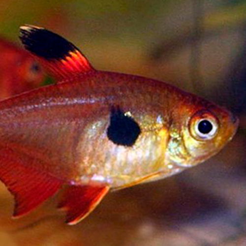

###  Global Prerequisites
`npm i -g nodemon typescript ts-node`

### Instaling
`npm install`

### Dev run Project
`npm run start-dev`

`

        
        
 Retriever

        
Color: White

        
Gender: Male

    

    

        
        
Zwergspitz

        
Color: Yellow

        
Gender: Female

    

    

        
        
Husky Siberiano

        
Color: White e Black

        
Gender: Male

    

    

        
        
Golden Retriever

        
Color: Yellow

        
Gender: Male

    

    

        
        
Poodle

        
Color: White

        
Gender: Female

    

    

        
        
Bulldog

        
Color: White e Yellow

        
Gender: Male

    

    

        
        
Persa

        
Color: Yellow

        
Gender: Male

    

    

        
        
Maine Coon

        
Color: Black e White

        
Gender: Male

    

    

        
        
Bengal

        
Color: White, Black e Yellow

        
Gender: Female

    

    

        
        
Siamês

        
Color: Yellow e Black

        
Gender: Male

    

    

        
        
Sphynx

        
Color: White

        
Gender: Male

    

    

        
        
Tetra Neon

        
Color: Red e Blue

        
Gender: Male

    

    

        
        
Mato Grosso

        
Color: Laranja

        
Gender: Male

    

    

        
        
Limpa Vidro

        
Color: Verde e White

        
Gender: Male

    

    

        
        
Tanictis

        
Color: Red

        
Gender: Male

    

    

        
        
Acará Bandeira

        
Color: Black

        
Gender: Male

    
`